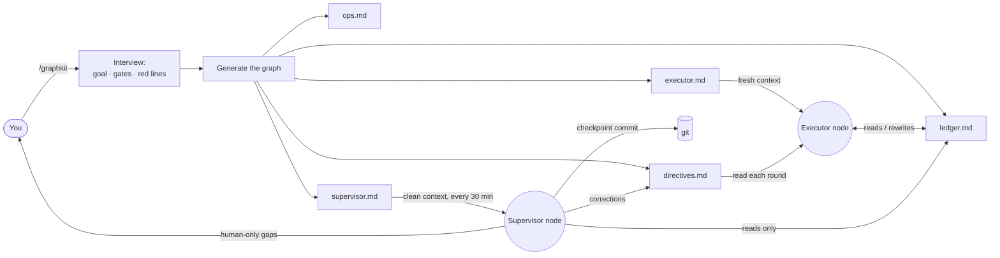

<div align="center">

# graphkit

**Run a long coding task as a small graph of agent nodes, not one drifting loop.**

A [Claude Code](https://claude.com/claude-code) skill that turns *"make this production-ready"* into an executor node that does the work and a supervisor node that watches from outside the executor's context and corrects drift before it compounds.

graphkit is **graph engineering** made concrete — the shift from tuning a single agent loop to wiring specialized agent roles into a graph. Two roles today; more planned.

[](LICENSE)
[](CONTRIBUTING.md)


English · [简体中文](README.zh-CN.md)

</div>

---

## The problem

Hand an agent a large, vague goal — *"get this repo to production quality"*, *"push accuracy above baseline"*, *"finish the migration"* — and over dozens of rounds it drifts:

- scope creep: new abstractions, v2 endpoints, config nobody asked for;
- fake "done": tests with no production call site, features that compile but do nothing;
- a quietly lowered bar: a frozen contract changed, a metric regressed;
- a lost thread: no single source of truth, so round 30 contradicts round 5.

The agent cannot catch this in itself: it reasons from the same history that produced the drift, so it will report itself on-spec. You end up reviewing every round by hand.

## From loop engineering to graph engineering

Loop engineering tries to fix this inside the loop — better prompts, more reminders, a bigger context window. It plateaus, because the loop's own history is what corrupts its judgment.

Graph engineering moves the structure outside the model: a small graph of specialized agent roles, each starting from a clean context, connected only by durable, inspectable state. graphkit applies this to one scenario — long-horizon coding — with the smallest useful graph:

- **Executor** — does the work, one item per round, against a single ledger.
- **Supervisor** — starts from a clean context on every tick, reads only the ledger and the git tree, and judges the run as an outside reviewer. It sees the drift the executor cannot, because it never shared the context in which the corner was cut.

The graph is designed to grow beyond these two roles — see the [roadmap](#roadmap-more-node-roles).

The nodes communicate only through inspectable state — a ledger, a git tree, a one-way directives file — so the discipline is enforced by the wiring:

- **One scoreboard.** `ledger.md` is the single source of truth. When code, docs and ledger disagree, the ledger is fixed first.
- **One item per round**, verified the same round, then logged. No batching, no deferred testing.
- **Forced convergence.** Every 5th round adds no features — it deletes dead code and tightens interfaces (net lines ≤ 0). A round adding over 400 net lines forces the next into convergence.
- **Register-then-defer.** Gaps found mid-round are logged, not silently patched or ignored.
- **Red lines that halt the run.** No unauthorized push, no destructive git on others' work, no secrets in commits, frozen contracts stay frozen, metrics never regress.
- **One-way corrections.** The supervisor corrects drift — and wasteful method, such as a full-cohort run without a pilot — only through the directives file. It never edits the ledger and never shares the executor's context. It decides by default; only a short owner-only list escalates to you.

No LangGraph, no Python runtime, no orchestration server: the nodes and edges are Markdown files any coding agent can follow.

## How it works



The executor works against the ledger; the supervisor watches from outside, commits clean checkpoints, and injects corrections through the directives edge. The two never share a context and never write the same file.

## One strong model, cheap execution

Because the nodes share no context, each can run on a different model. The discipline is what makes a cheap executor safe: its scope is capped at one item per round, the rules live in the ledger and directives rather than in its context, and a stronger model reviews the result.

| Node | Runs | Model | Why |
| --- | --- | --- | --- |
| Authoring (`/graphkit` interview) | once | your best model | designing gates, red lines and milestones is the judgment call |
| Executor | every round | a cheap / fast agent — a budget tier, a local model, an OSS coder | it follows an explicit ledger one step at a time |
| Supervisor | every ~30 min | a strong model | judging a run from a cold read is the hardest call, but it fires rarely |

The executor prompt is plain Markdown pointing at plain Markdown — paste it into whichever agent is cheapest. The expensive reasoning is concentrated in authoring and the occasional audit, not spent on every round.

## Hosts vs nodes

A *node* is a role — executor, supervisor. A *host* is only what keeps a node alive across turns: a Grok `/goal` session, a Claude `CronCreate` tick, or you pasting into a fresh chat. Hosts are interchangeable; the graph doesn't change. Two rules stop a host from turning into a second scoreboard:

- **Keep the ledger a live file, not host text.** Hand the host the executor prompt, but the ledger and directives stay files the node re-reads each round — never folded into the host's own goal/prompt text, where they go stale. A host's progress UI (a goal's done-bar) *mirrors* the ledger; it never replaces it, and the ledger wins every conflict.
- **The supervisor is always its own host, in a fresh context** — a separate session or a cron tick, never a subagent inside the executor's session. That subagent would share the context the whole method keeps clean.

So a cheap executor on one host and a strong supervisor on another is a first-class setup, not a special integration. Launch snippets live in [`templates/hosts/`](templates/hosts/), split by what the runtime gives you: **goal-based** hosts run a task to completion with a done signal (Grok `/goal`, Codex delegated task); **loop-based** hosts re-invoke each round and the node resumes from the ledger (Cursor background agent, Claude Code `/loop`+cron, a shell `while`). Either way the launcher is a thin pointer at the run files, so the node re-reads live files instead of drifting from a pasted prompt. Each run's generated `LAUNCH.md` fills the right snippet in with real paths.

## Quickstart

1. **Install:**

   ```bash
   curl -fsSL https://raw.githubusercontent.com/levi-qiao/graphkit/main/install.sh | sh
   ```

   <sub>Or by hand: `git clone https://github.com/levi-qiao/graphkit ~/.claude/skills/graphkit`</sub>

2. **Run `/graphkit` in Claude Code** and answer the interview: repos and branches, the goal and how it is verified, milestones, gate commands, red lines, commit authorization, supervisor interval. The files land in a fresh `.graphkit/<date-slug>/` directory in your repo — one directory per run; a new run never edits an old run's files. ([What each file does →](#files-generated-per-run))

3. **Start the executor** on its host, using the snippet in the generated `LAUNCH.md`. On a goal host (Grok, Codex) it's a thin launcher that runs round after round to completion; on a loop host (Cursor, Claude Code, a shell) an external loop re-invokes it each round. Either way it resumes from the ledger if the session dies, rather than waiting for you to nudge it each turn.

4. **Start the supervisor** (optional, recommended): graphkit schedules `supervisor.md` at your interval — in Claude Code via cron, otherwise a fresh session each interval.

Without Claude Code, fill in `templates/` by hand — the method does not depend on the runtime.

## Repository layout

These files are read, not edited:

| Path | What it is |
| --- | --- |
| [`SKILL.md`](SKILL.md) | The skill entry: the interview and generation flow behind `/graphkit`. |
| [`templates/`](templates/) | Node and edge templates the skill fills in per run; usable by hand outside Claude Code. |
| [`docs/methodology.md`](docs/methodology.md) | The rationale: each rule and the failure mode it prevents. |
| [`examples/add-tests-to-cli/`](examples/add-tests-to-cli/) | A worked run — executor and ledger three rounds in. Start here. |
| [`examples/migrate-blob-storage/`](examples/migrate-blob-storage/) | A longer worked run — milestones, a pilot-before-cohort backfill, a convergence round, and a supervisor directive catching self-reported evidence. |

## Files generated per run

Each run gets a fresh `.graphkit/<date-slug>/` in your repo:

| File | Written by | Role |
| --- | --- | --- |
| `executor.md` | generated once | The executor prompt. Paste into a fresh agent context to start the node. |
| `ledger.md` | the executor, every round | Single source of truth: goals, gates, round log, open gaps. Read this to follow the run. |
| `directives.md` | the supervisor, one-way | Corrections, read by the executor each round. You can append your own. |
| `ops.md` | any node, append-only | Durable environment, build and data facts. |
| `supervisor.md` | generated once | The supervisor prompt; scheduled automatically in Claude Code. |
| `LAUNCH.md` | generated once | Copy-paste launch snippets for the chosen hosts (Grok `/goal`, cron, paste). A convenience index, not a scoreboard. |

## When to use it

Use it when the task spans many rounds, success is verifiable (tests, gates, metrics) and drift is a real risk. Skip it for one-shot edits, or for work where every step needs a human to judge success.

## FAQ

**Why a graph and not "a loop with a monitor"?** The load-bearing property is that the supervisor is a separate node with its own clean context, connected to the executor only by inspectable edges. That separation — not the schedule — is what lets it catch drift the executor can't. Multi-agent frameworks model runs as graphs for the same reason; graphkit does it with Markdown instead of a runtime.

**Does it require Claude Code?** The skill packaging and supervisor scheduling are Claude Code features, but the nodes and edges are plain Markdown — the method is agent-agnostic. The intended setup is mixed: author the graph once with a strong model, then run the executor on whatever agent is cheapest.

**Isn't a fixed 5th-round convergence arbitrary?** It's a default; the interview lets you tune the interval and the net-line cap. What matters is that a forcing function exists, not the exact number.

**Can a node commit or push on its own?** Only if you authorize it in the interview. The safe default: the executor implements and verifies, commits are a separate authorized step (often the supervisor's), and push is never automatic.

## Roadmap: more node roles

Executor plus supervisor is the smallest useful graph, not the whole idea. A role is one Markdown node plus an inspectable edge — no framework, no runtime — so the graph grows one file at a time. Planned roles: a red-team reviewer that probes "done" claims, a scout that researches options off the critical path and reports into the ledger, and a test oracle that owns the gates so the executor cannot grade its own work. These make good first contributions.

## Contributing

Issues and PRs welcome — see [CONTRIBUTING.md](CONTRIBUTING.md).

## License

[MIT](LICENSE) © 2026 levi-qiao
