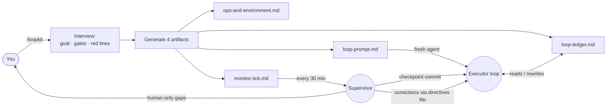

<div align="center">

# 🔁 loopkit

**Run a long-horizon coding task as a self-supervised agentic loop — that stays on-spec.**

A [Claude Code](https://claude.com/claude-code) skill that turns *"make this production-ready"* into a disciplined multi-round loop with a single scoreboard, hard anti-bloat rules, and an optional supervisor that checkpoints and corrects drift.

[](LICENSE)
[](CONTRIBUTING.md)


English · [简体中文](README.zh-CN.md)

</div>

---

## The problem

Hand an agent a big, vague goal — *"get this repo to production quality"*, *"push accuracy above baseline"*, *"finish the migration"* — and over dozens of rounds it drifts:

- it **scope-creeps**: new abstractions, v2 endpoints, "flexible" config nobody asked for;
- it fakes **"looks done"**: tests with no production call site, features that compile but do nothing;
- it quietly **lowers the bar**: changes a frozen contract, regresses a metric, "improves" adjacent code;
- it **loses the thread**: no single source of truth, so round 30 contradicts round 5.

You end up babysitting every round anyway.

## The idea

**loopkit** interviews you once, then generates a loop that an agent can run for many rounds *without* babysitting, because the discipline is baked into rules the agent can't rationalize around:

- 🧾 **One scoreboard.** A single `loop-ledger.md` is the only source of truth. Code, docs, and ledger disagree → fix the ledger first.
- 🎯 **One item per round → verify same round → update ledger.** No batching, no "I'll test later."
- 🧹 **Forced convergence.** Every 5th round adds zero features — only deletes dead code and tightens interfaces (net lines ≤ 0). A round that adds >400 net lines forces the next to converge.
- 📌 **Register-then-defer.** Every gap found mid-round is *logged*, never silently patched, never ignored.
- 🚧 **Red lines that halt the loop.** No push without authorization, no destructive git on others' work, no secrets in commits, frozen contracts stay frozen, metrics only go up.
- 👀 **Optional supervisor.** A scheduled tick checkpoint-commits clean work and corrects drift — *without ever editing the ledger the executor is writing.*

## How it works



The executor runs the loop against the ledger. The supervisor watches, commits clean checkpoints, and injects course-corrections through a directives file — the two never fight over the same file.

## Quickstart

1. **Install the skill** (clone into your Claude Code skills folder):

   ```bash
   git clone https://github.com/levi-qiao/loop-skill ~/.claude/skills/loopkit
   ```

2. **Invoke it** in Claude Code:

   ```
   /loopkit
   ```

   Answer the short interview (repos & branches, the goal + how it's verified, milestones, gate commands, red lines, commit authorization, whether you want a supervisor).

3. **Start the executor.** loopkit hands you a `loop-prompt.md` — paste it into a fresh agent context (or your loop mechanism) and let it run.

4. **Start the supervisor** (optional). loopkit schedules `monitor-tick.md` on your interval and watches from there.

> No Claude Code? The `templates/` are plain Markdown — fill them in by hand and the methodology still works with any agent.

## What's in the box

| Path | What |
| --- | --- |
| [`SKILL.md`](SKILL.md) | The skill entry — the interview + generation flow. |
| [`templates/loop-prompt.md`](templates/loop-prompt.md) | The executor prompt template. |
| [`templates/ledger.md`](templates/ledger.md) | The single-scoreboard template. |
| [`templates/ops-and-environment.md`](templates/ops-and-environment.md) | Durable env/build/data facts template. |
| [`templates/monitor-tick.md`](templates/monitor-tick.md) | The supervisor prompt template. |
| [`docs/methodology.md`](docs/methodology.md) | Deep dive: every rule and the failure it prevents. |
| [`examples/add-tests-to-cli/`](examples/add-tests-to-cli/) | A fully worked, generic example. |

## When to use it (and when not to)

**Use it** when the task spans many rounds, success is verifiable (tests / gates / metrics), and there's real risk of scope creep or a quietly lowered bar.

**Don't** use it for a one-shot edit, or when every step needs a human to judge success — a plain task is better there.

## FAQ

**Does this only work with Claude Code?** The skill packaging and the `CronCreate`-based supervisor are Claude Code features, but the four artifacts are plain Markdown — the methodology is agent-agnostic.

**Won't a fixed 5th-round convergence be arbitrary?** It's a default; the interview lets you tune the interval and the net-line cap. The point is that *some* forcing function exists, not the exact number.

**Can the loop commit / push on its own?** Only if you authorize it in the interview. The safe default: the executor implements and verifies; commits are a separate authorized step (often the supervisor's job), and push is never automatic.

## Contributing

Issues and PRs welcome — see [CONTRIBUTING.md](CONTRIBUTING.md). If loopkit saved you a weekend of babysitting an agent, a ⭐ helps others find it.

## License

[MIT](LICENSE) © 2026 levi-qiao
