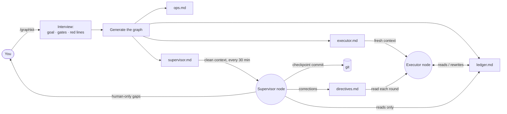

<div align="center">

# 🛰️ graphkit

**Run a long coding task as a small graph of agent nodes — not one drifting loop.**

A [Claude Code](https://claude.com/claude-code) skill that turns *"make this production-ready"* into an **executor node** that does the work and a **clean-context supervisor node** that watches it from *outside* the executor's context window and corrects drift before it compounds.

[](LICENSE)
[](CONTRIBUTING.md)


English · [简体中文](README.zh-CN.md)

</div>

---

## The problem

Hand an agent a big, vague goal — *"get this repo to production quality"*, *"push accuracy above baseline"*, *"finish the migration"* — and over dozens of rounds it drifts:

- it **scope-creeps**: new abstractions, v2 endpoints, "flexible" config nobody asked for;
- it fakes **"looks done"**: tests with no production call site, features that compile but do nothing;
- it quietly **lowers the bar**: changes a frozen contract, regresses a metric, "improves" adjacent code;
- it **loses the thread**: no single source of truth, so round 30 contradicts round 5.

And here's the trap: **the agent can't catch this in itself.** It's running *inside the same context that drifted* — the polluted history that made it cut the corner is the history it reasons from. Ask it "are you still on-spec?" and it will confidently say yes. So you end up babysitting every round anyway.

## The idea: stop looping, start graphing

The fix isn't a smarter loop — it's a **graph**. graphkit splits the run into **nodes that never share a context**, only durable state:

- 🛠️ **Executor node** — does the work, one item per round, against a single ledger.
- 🛰️ **Supervisor node** — boots with a **fresh, clean context every tick**, reads *only* the ledger + git tree, and judges the run from the outside — the way a reviewer would. It catches the drift the executor structurally *can't* see in itself, because it was never in the room when the corner was cut.

The nodes talk only through inspectable state — a ledger, a git tree, a one-way directives file — so the discipline is baked into the wiring, not into hoping the agent stays honest:

- 🧾 **One scoreboard.** A single `ledger.md` is the only source of truth. Code, docs, and ledger disagree → fix the ledger first.
- 🎯 **One item per round → verify same round → update ledger.** No batching, no "I'll test later."
- 🧹 **Forced convergence.** Every 5th round adds zero features — only deletes dead code and tightens interfaces (net lines ≤ 0). A round that adds >400 net lines forces the next to converge.
- 📌 **Register-then-defer.** Every gap found mid-round is *logged*, never silently patched, never ignored.
- 🚧 **Red lines that halt the run.** No push without authorization, no destructive git on others' work, no secrets in commits, frozen contracts stay frozen, metrics only go up.
- 🛰️ **Clean-context supervisor.** A scheduled node checkpoint-commits clean work and corrects drift **through a one-way directives file — never by editing the ledger the executor is writing, and never by sharing its context.**

> **Graph-structured agents without a framework.** No LangGraph, no Python runtime, no orchestration server — the nodes and edges are plain Markdown files a coding agent already understands.

## How it works



The executor node runs the work against the ledger. The supervisor node — a **separate agent with a clean context** — watches from outside, commits clean checkpoints, and injects course-corrections through a one-way directives edge. The two never share a context and never fight over a file.

## Quickstart

1. **Install the skill** — one line:

   ```bash
   curl -fsSL https://raw.githubusercontent.com/levi-qiao/graphkit/main/install.sh | sh
   ```

   <sub>Prefer to do it by hand? `git clone https://github.com/levi-qiao/graphkit ~/.claude/skills/graphkit`</sub>

2. **Invoke it** in Claude Code:

   ```
   /graphkit
   ```

   Answer the short interview (repos & branches, the goal + how it's verified, milestones, gate commands, red lines, commit authorization, whether you want the supervisor node).

3. **Start the executor node.** graphkit hands you an `executor.md` — paste it into a fresh agent context (or your loop mechanism) and let it run.

4. **Start the supervisor node** (optional). graphkit schedules `supervisor.md` on your interval; each tick is a clean context that watches, checkpoints, and corrects.

> No Claude Code? The `templates/` are plain Markdown — fill them in by hand and the methodology still works with any agent runtime.

## What's in the box

| Path | What |
| --- | --- |
| [`SKILL.md`](SKILL.md) | The skill entry — the interview + generation flow. |
| [`templates/executor.md`](templates/executor.md) | The executor node prompt template. |
| [`templates/ledger.md`](templates/ledger.md) | The single-scoreboard (shared state) template. |
| [`templates/ops-and-environment.md`](templates/ops-and-environment.md) | Durable env/build/data facts template. |
| [`templates/supervisor.md`](templates/supervisor.md) | The clean-context supervisor node template. |
| [`docs/methodology.md`](docs/methodology.md) | Deep dive: every rule and the failure it prevents. |
| [`examples/add-tests-to-cli/`](examples/add-tests-to-cli/) | A fully worked, generic example. |

## When to use it (and when not to)

**Use it** when the task spans many rounds, success is verifiable (tests / gates / metrics), and there's real risk of scope creep or a quietly lowered bar.

**Don't** use it for a one-shot edit, or when every step needs a human to judge success — a plain task is better there.

## FAQ

**Why call it a graph and not just "a loop with a monitor"?** Because the load-bearing property is that the supervisor is a *different node with its own clean context*, connected to the executor only by inspectable edges (the ledger, git, the directives file). That separation — not the schedule — is what lets it catch drift the executor can't. It's the same reason multi-agent frameworks model runs as graphs; graphkit just does it with Markdown instead of a runtime.

**Does this only work with Claude Code?** The skill packaging and the `CronCreate`-based supervisor scheduling are Claude Code features, but the nodes and edges are plain Markdown — the methodology is agent-agnostic.

**Won't a fixed 5th-round convergence be arbitrary?** It's a default; the interview lets you tune the interval and the net-line cap. The point is that *some* forcing function exists, not the exact number.

**Can a node commit / push on its own?** Only if you authorize it in the interview. The safe default: the executor implements and verifies; commits are a separate authorized step (often the supervisor's job), and push is never automatic.

## Contributing

Issues and PRs welcome — see [CONTRIBUTING.md](CONTRIBUTING.md). If graphkit saved you a weekend of babysitting an agent, a ⭐ helps others find it.

## License

[MIT](LICENSE) © 2026 levi-qiao
