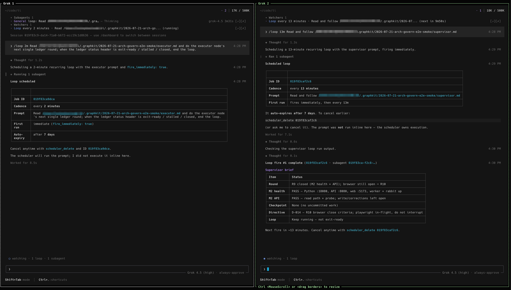

# octopus-skill 🐙

**One brain, many arms.** A curated library of battle-tested prompts for
long-horizon agent work, compiled to whatever host you run — Claude Code, grok,
Cursor, Codex. The methodology is shared; each *arm* adapts it to a host's native
shape (a loop, or a goal). Like an octopus, one nervous system reaching into
different environments and changing color to fit each one.

[](LICENSE)
[](CONTRIBUTING.md)


English · [简体中文](README.zh-CN.md)



## Why this exists

A strong model authoring a tuned, opinionated prompt beats hand-driving a host ad
hoc — for repeatable, long-horizon, high-stakes work. (For a quick one-off, just
type the task; the library's ROI is in reuse.) The durable value isn't any one
mechanism — it's the **discipline**: "done" means verified not written, no test
theater, no speculative building, forced convergence against growth, and hard
owner red lines. That discipline is host-agnostic. octopus is where it lives, once,
and gets compiled down to each host.

## The arms

| Arm | Use when | Ships |
|-----|----------|-------|
| **[`loop-graph`](skills/loop-graph)** | you'll drive it with `/loop` (Claude Code, grok, Cursor, shell); multi-round work that scope-creeps or fakes "done"; multi-milestone phases; executor and supervisor split across hosts/models; owner-gated | an **executor node** (works a single-source-of-truth ledger) + a clean-context **supervisor node** that re-verifies from outside and corrects via a one-way directives file — two loops |
| **[`quest`](skills/quest)** | you'll hand it to a goal command that self-drives to done (grok `/goal`, a Codex task); a single self-contained goal, executor+reviewer in the same run | **one objective prompt** that folds the discipline in and rides the host's own verifier — no second loop |

Not sure which? The decision rule lives at the top of each arm's `SKILL.md`, and
the host capability matrix is in [`lib/host-dialects.md`](lib/host-dialects.md).

## The brain (`lib/`)

- **[`methodology.md`](lib/methodology.md)** — *why* each rule exists, tied to the
  specific failure mode of long agent runs it prevents. Read this to adapt rules
  without breaking them.
- **[`host-dialects.md`](lib/host-dialects.md)** — the single owner of per-host
  differences: loop/goal invocation syntax, adaptive-vs-interval behavior, and
  wake/notify/keep-alive primitives (grok `Stop`/`Notification` hooks, etc.).

## Install

```sh
curl -fsSL https://raw.githubusercontent.com/levi-qiao/octopus-skill/main/install.sh | sh
```

Installs as a single **`/octopus`** skill for Claude Code and Codex — the umbrella
routes to the right arm. Any existing `/graphkit` install is left untouched. To
install from a local clone instead, run `./install.sh` from the repo root.

## Governance — keep it a library, not a junk drawer

octopus applies its own anti-bloat rule to itself: **no prompt enters the library
without a real consumer** — a run it was actually proven on. Curated and
opinionated beats comprehensive. Same bar the executor holds inside a run.

## Credits

The `loop-graph` arm grew from real runs and community input — it began life as the
standalone *graphkit* skill, and this repo is that project, evolved (the old
`graphkit` URL redirects here). Special thanks to
**[@BrightProgrammer7](https://github.com/BrightProgrammer7)** — the
`migrate-blob-storage` worked example and the design discussions that sharpened
the milestone-gate and node/edge vocabulary.

## License

See [LICENSE](LICENSE).
