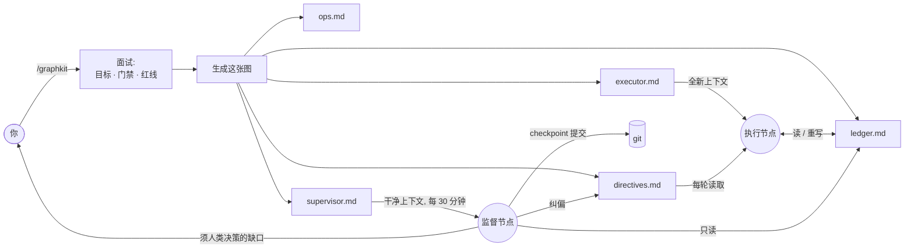

<div align="center">

# 🛰️ graphkit

**把长周期编码任务，跑成一张"智能体节点图"——而不是一个会漂移的循环。**

一个 [Claude Code](https://claude.com/claude-code) 技能：把"让这个项目达到生产标准"这类模糊目标，拆成一个**执行节点**（干活）和一个**干净上下文的监督节点**——后者站在执行方的上下文*之外*盯着它，在漂移滚雪球之前纠偏。

*graphkit 是 **graph engineering(图工程)** 的一次具体落地——从「调教一个智能体循环」转向「把分工明确的智能体角色接成一张图」。今天是两个角色,后续会加入更多。*

[](LICENSE)
[](CONTRIBUTING.md)


[English](README.md) · 简体中文

</div>

---

## 痛点

给智能体一个又大又模糊的目标——"把这个仓库做到生产质量""把精度提到基线以上""完成迁移"——跑上几十轮它就开始漂移：

- **范围蔓延**：没人要的新抽象、v2 端点、"灵活"配置；
- **假装完成**：写了没有生产调用面的测试、能编译却什么也不做的功能；
- **偷偷降标**：改了冻结契约、让某个指标回退、"顺手优化"了旁边的代码；
- **丢失主线**：没有唯一真相，第 30 轮和第 5 轮自相矛盾。

真正的陷阱是：**智能体自己发现不了这些。** 它就跑在*那个已经漂移的上下文里*——让它抄近路的那段被污染的历史，正是它推理时依据的历史。你问它"还在按规格走吗？"，它会自信地说是。于是你还是得每一轮盯着它。

## 思路：从 loop engineering 到 graph engineering

**Loop engineering（循环工程）** 是今天大多数人的做法：抱着一个长活的智能体循环使劲调——更好的提示词、更多提醒、更大的上下文窗口。它注定有天花板，因为污染这个循环判断力的，恰恰是它自己的历史。

**Graph engineering（图工程）** 是另一条路：设计一张由*分工明确的智能体角色*组成的小图，每个角色以自己的干净上下文启动，只通过持久、可检视的状态相连。graphkit 就是这个理念在"长周期编码"这一个场景下的具体落地，从最小可用的两个角色起步：

- 🛠️ **执行节点**——干活，一轮只做一项，对着唯一台账推进。
- 🛰️ **监督节点**——每个 tick 都以**全新的、干净的上下文**启动，*只*读台账 + git 树，像评审一样从外部审视这次运行。它能抓到执行方结构性*看不见*的漂移——因为抄近路的时候，它根本不在场。

今天是两个角色；这张图天生是要长大的——见[路线图](#路线图更多节点角色)。

节点之间只通过可检视的状态说话——一份台账、一棵 git 树、一个单向 directives 文件——纪律因此被焊进了接线里，而不是寄望于"智能体自觉"：

- 🧾 **唯一记分板。** 单一 `ledger.md` 是唯一真相。代码、文档、台账冲突 → 先修台账。
- 🎯 **一轮只做一项 → 当轮验证 → 更新台账。** 不批处理，不"以后再测"。
- 🧹 **强制收敛。** 每第 5 轮零新功能——只删死代码、收紧接口（净行数 ≤ 0）。单轮净增 >400 行则下一轮强制收敛。
- 📌 **发现即登记。** 任何中途发现的缺口都登记进台账，不静默修、不忽略。
- 🚧 **红线即停。** 未授权不 push、不对他人改动做破坏性 git、密钥绝不入提交、冻结契约保持冻结、指标只升不降。
- 🛰️ **干净上下文的监督节点。** 定时巡检，checkpoint 提交干净成果并纠偏——不止抓违规，也纠低效方法（比如没跑小样本 pilot 就要全量烧一遍）——**只经一个单向 directives 文件下达，绝不编辑执行方正在写的台账，也绝不与它共享上下文。** 它默认自己裁决：只有一小份 owner-only 清单才升级到你，运行不会干等人。

> **不用框架的图结构智能体。** 没有 LangGraph、没有 Python 运行时、没有编排服务——节点和边就是几份智能体本就看得懂的 Markdown。

## 工作原理



执行节点对着台账跑。监督节点——一个**拥有干净上下文的独立智能体**——从外部盯着它、提交干净的 checkpoint、经一条单向 directives 边注入纠偏。两者永不共享上下文、永不争抢同一个文件。

## 省钱跑：一个聪明大脑 + 一支廉价劳工

因为节点**互不共享上下文**——只通过 Markdown 通信——所以每个节点都能跑在**不同的模型**上。而 graphkit 的纪律，恰恰是让**廉价执行方**也能放心用的原因：

- 它的野心被锁死在**一轮一项**——想跑去自建框架都不行；
- 规则活在**模型之外**（台账 + directives 文件里），不靠它"记住"一大段提示词；
- 一个**聪明的监督方在盯着**弱模型会犯的错，在滚雪球之前纠掉。

于是你只在"判断力真正值钱"的地方花高级模型的 token：

| 节点 | 频率 | 交给…… | 为什么 |
| --- | --- | --- | --- |
| **搭图**（`/graphkit` 面试） | 一次 | 你最强的模型 | 设计门禁、红线、里程碑是判断活 |
| 🛠️ **执行节点** | 每轮、全天 | 一个**廉价/快模型**——Cursor 低价档、Grok、本地模型、开源 coder | 它只是一步步照着显式台账走；图结构从根上禁止范围蔓延 |
| 🛰️ **监督节点** | 每 ~30 分钟 | 一个**强模型** | 冷读判漂移是最难的活——但它极少触发，总量上很便宜 |

执行方的提示词就是"指向纯 Markdown 的纯 Markdown"——**哪家 agent 便宜就粘进哪家**，不必是 Claude。贵的推理集中在搭图和偶尔的巡检上、不烧在每一轮，于是你用极小的 token 账单，换来干活环节的一流可靠性。

## 快速开始

1. **安装技能** —— 一行搞定：

   ```bash
   curl -fsSL https://raw.githubusercontent.com/levi-qiao/graphkit/main/install.sh | sh
   ```

   <sub>想手动？`git clone https://github.com/levi-qiao/graphkit ~/.claude/skills/graphkit`</sub>

2. **在 Claude Code 里调用**：

   ```
   /graphkit
   ```

   回答简短面试（仓库与分支、目标 + 如何验证、里程碑、门禁命令、红线、提交授权、是否要监督节点）。graphkit 会把整张图生成到你仓库里一个全新的 `.graphkit/<日期-slug>/` 目录——**一次 run 一个目录**；新 run 绝不改旧 run 的文件，只把仍成立的结论蒸馏进自己的起点快照。（[每个生成文件是干嘛的 →](#一次-run-的地图graphkit-生成的文件)）

3. **启动执行节点。** graphkit 交给你一份 `executor.md`——粘进一个全新 agent 上下文让它跑。它是"指向台账的纯 Markdown"，所以这里完全可以用**廉价 agent**（Cursor 低价档、Grok、本地模型），不必是 Claude。用什么方式循环随你（`while` + 唤醒、cron，或每轮重新粘一次）。

4. **启动监督节点**（可选，推荐）。graphkit 按你的间隔调度 `supervisor.md`；每个 tick 都是一个**全新的干净上下文**，盯梢、checkpoint、纠偏。这个节点请配**强模型**——它极少触发，全部价值就在于抓住廉价执行方抓不到的东西。

> 没有 Claude Code？`templates/` 都是纯 Markdown——手动填好，方法论在任何智能体运行时上照样成立。

## 仓库地图——每个文件是干嘛的

这些文件你都不用手改；了解它们是什么，一切就不神秘了：

| 路径 | 是什么 |
| --- | --- |
| [`SKILL.md`](SKILL.md) | 技能本体——你敲 `/graphkit` 时 Claude Code 执行的面试 + 生成流程。 |
| [`templates/`](templates/) | 空白的节点与边模板，技能按 run 填充。没有 Claude Code？手动填好照样用——方法论不挑运行时。 |
| [`docs/methodology.md`](docs/methodology.md) | 讲*为什么*：每条规则防的是哪种失败。哪条规则看着武断，就来这里查。 |
| [`examples/add-tests-to-cli/`](examples/add-tests-to-cli/) | 一次跑完的样例——真实的 executor + 台账跑到第 3 轮长什么样。**最适合第一个读。** |

## 一次 run 的地图——`/graphkit` 生成的文件

每次 run 在*你的*仓库里得到一个全新的 `.graphkit/<日期-slug>/`。五个文件——谁写、你拿它干什么：

| 文件 | 谁写 | 你拿它干什么 |
| --- | --- | --- |
| `executor.md` | 生成一次 | **粘进一个全新 agent 上下文**——执行节点就此启动。用你手里最便宜的 agent 就行。 |
| `ledger.md` | 执行节点，每轮更新 | **看它就能跟上进度。** 唯一真相：目标、门禁、每轮日志、未决缺口。 |
| `directives.md` | 监督节点（单向） | 纠偏指令落在这里，执行节点每轮读取。你随时也可以自己追加一条。 |
| `ops.md` | 各节点，只追加 | 环境/构建/数据的持久事实，免得每个节点从头摸一遍。 |
| `supervisor.md` | 生成一次 | 监督节点的提示词。在 Claude Code 里自动排期；每个 tick 都是干净上下文。 |

## 何时用，何时别用

**适用**：任务跨很多轮、成功可验证（测试/门禁/指标）、且确有范围蔓延或降标风险。

**不适用**：一次性小改，或每一步都需要人来判断是否成功——那种情况用普通任务更好。

## 常见问题

**凭什么叫"图"，而不是"带监控的循环"？** 因为真正吃劲的性质是：监督方是一个*拥有独立干净上下文的不同节点*，只经可检视的边（台账、git、directives 文件）与执行方相连。是这层隔离——而非那张定时表——让它能抓到执行方抓不到的漂移。这也正是多智能体框架把运行建模成图的原因；graphkit 只是用 Markdown 而非运行时实现了它。

**只能配 Claude Code 用吗？** 技能封装与基于 `CronCreate` 的监督调度是 Claude Code 特性，但节点与边都是纯 Markdown——方法论与具体智能体无关。事实上推荐的用法就是*混搭*：用高级模型搭一次图，之后执行节点交给最便宜的 agent 跑。

**执行方真能用廉价模型？** 能——这就是设计初衷。弱模型一拿到模糊目标就范围蔓延、假装完成；graphkit 递给它的是一个*极小又显式*的目标（一条台账项、验证、停），把规则放在它上下文之外，再派一个聪明监督方盯着。结构替廉价模型完成了它做不到的推理，于是你只为"搭图 + 偶尔巡检"付高级模型的价。

**固定第 5 轮收敛会不会太武断？** 那只是默认值；面试里可调间隔与净行数上限。关键是存在*某个*强制收敛机制，而非具体数字。

**节点能自己 commit / push 吗？** 仅当你在面试里授权。安全默认：执行方只实现+验证；提交是单独的授权步骤（常由监督节点做），push 永不自动。

## 路线图：更多节点角色

执行 + 监督只是*最小*可用的图，不是这个理念的全部。因为一个角色不过是"一份 Markdown 节点 + 一条可检视的边"——没有框架、没有运行时——这张图可以一次一个文件地长大。计划中的角色：**红队评审**（对"已完成"的断言做对抗性拷问）、**侦察/调研**（在关键路径之外探索方案、汇报进台账）、**测试裁判**（独占门禁，让执行方没法自己给自己判卷）。如果 graph engineering 这套实践打动了你，这些就是最好的第一批 PR。

## 贡献

欢迎 Issue 与 PR，见 [CONTRIBUTING.md](CONTRIBUTING.md)。如果 graphkit 帮你省下了盯梢智能体的一个周末，点个 ⭐ 能让更多人找到它。

## 许可证

[MIT](LICENSE) © 2026 levi-qiao
