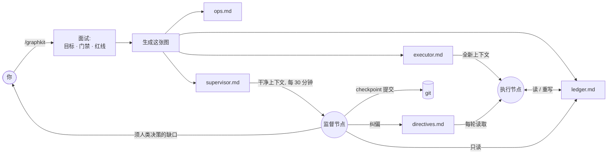

<div align="center">

# 🛰️ graphkit

**把长周期编码任务，跑成一张"智能体节点图"——而不是一个会漂移的循环。**

一个 [Claude Code](https://claude.com/claude-code) 技能：把"让这个项目达到生产标准"这类模糊目标，拆成一个**执行节点**（干活）和一个**干净上下文的监督节点**——后者站在执行方的上下文*之外*盯着它，在漂移滚雪球之前纠偏。

[](LICENSE)
[](CONTRIBUTING.md)


[English](README.md) · 简体中文

</div>

---

## 痛点

给智能体一个又大又模糊的目标——"把这个仓库做到生产质量""把精度提到基线以上""完成迁移"——跑上几十轮它就开始漂移：

- **范围蔓延**：没人要的新抽象、v2 端点、"灵活"配置；
- **假装完成**：写了没有生产调用面的测试、能编译却什么也不做的功能；
- **偷偷降标**：改了冻结契约、让某个指标回退、"顺手优化"了旁边的代码；
- **丢失主线**：没有唯一真相，第 30 轮和第 5 轮自相矛盾。

真正的陷阱是：**智能体自己发现不了这些。** 它就跑在*那个已经漂移的上下文里*——让它抄近路的那段被污染的历史，正是它推理时依据的历史。你问它"还在按规格走吗？"，它会自信地说是。于是你还是得每一轮盯着它。

## 思路：别再 loop，改成 graph

解法不是"更聪明的循环"，而是一张**图**。graphkit 把一次运行拆成**互不共享上下文、只通过持久状态通信的节点**：

- 🛠️ **执行节点**——干活，一轮只做一项，对着唯一台账推进。
- 🛰️ **监督节点**——每个 tick 都以**全新的、干净的上下文**启动，*只*读台账 + git 树，像评审一样从外部审视这次运行。它能抓到执行方结构性*看不见*的漂移——因为抄近路的时候，它根本不在场。

节点之间只通过可检视的状态说话——一份台账、一棵 git 树、一个单向 directives 文件——纪律因此被焊进了接线里，而不是寄望于"智能体自觉"：

- 🧾 **唯一记分板。** 单一 `ledger.md` 是唯一真相。代码、文档、台账冲突 → 先修台账。
- 🎯 **一轮只做一项 → 当轮验证 → 更新台账。** 不批处理，不"以后再测"。
- 🧹 **强制收敛。** 每第 5 轮零新功能——只删死代码、收紧接口（净行数 ≤ 0）。单轮净增 >400 行则下一轮强制收敛。
- 📌 **发现即登记。** 任何中途发现的缺口都登记进台账，不静默修、不忽略。
- 🚧 **红线即停。** 未授权不 push、不对他人改动做破坏性 git、密钥绝不入提交、冻结契约保持冻结、指标只升不降。
- 🛰️ **干净上下文的监督节点。** 定时巡检，checkpoint 提交干净成果并纠偏——**只经一个单向 directives 文件下达，绝不编辑执行方正在写的台账，也绝不与它共享上下文。**

> **不用框架的图结构智能体。** 没有 LangGraph、没有 Python 运行时、没有编排服务——节点和边就是几份智能体本就看得懂的 Markdown。

## 工作原理



执行节点对着台账跑。监督节点——一个**拥有干净上下文的独立智能体**——从外部盯着它、提交干净的 checkpoint、经一条单向 directives 边注入纠偏。两者永不共享上下文、永不争抢同一个文件。

## 快速开始

1. **安装技能** —— 一行搞定：

   ```bash
   curl -fsSL https://raw.githubusercontent.com/levi-qiao/graphkit/main/install.sh | sh
   ```

   <sub>想手动？`git clone https://github.com/levi-qiao/graphkit ~/.claude/skills/graphkit`</sub>

2. **在 Claude Code 里调用**：

   ```
   /graphkit
   ```

   回答简短面试（仓库与分支、目标 + 如何验证、里程碑、门禁命令、红线、提交授权、是否要监督节点）。

3. **启动执行节点。** graphkit 交给你一份 `executor.md`——粘进一个全新 agent 上下文（或你的循环机制）让它跑。

4. **启动监督节点**（可选）。graphkit 按你的间隔调度 `supervisor.md`；每个 tick 都是一个干净上下文，盯梢、checkpoint、纠偏。

> 没有 Claude Code？`templates/` 都是纯 Markdown——手动填好，方法论在任何智能体运行时上照样成立。

## 目录

| 路径 | 说明 |
| --- | --- |
| [`SKILL.md`](SKILL.md) | 技能入口——面试 + 生成流程。 |
| [`templates/executor.md`](templates/executor.md) | 执行节点提示词模板。 |
| [`templates/ledger.md`](templates/ledger.md) | 唯一记分板（共享状态）模板。 |
| [`templates/ops-and-environment.md`](templates/ops-and-environment.md) | 环境/构建/数据事实模板。 |
| [`templates/supervisor.md`](templates/supervisor.md) | 干净上下文监督节点模板。 |
| [`docs/methodology.md`](docs/methodology.md) | 深度解析：每条规则防的是哪种失败。 |
| [`examples/add-tests-to-cli/`](examples/add-tests-to-cli/) | 一个完整的脱敏样例。 |

## 何时用，何时别用

**适用**：任务跨很多轮、成功可验证（测试/门禁/指标）、且确有范围蔓延或降标风险。

**不适用**：一次性小改，或每一步都需要人来判断是否成功——那种情况用普通任务更好。

## 常见问题

**凭什么叫"图"，而不是"带监控的循环"？** 因为真正吃劲的性质是：监督方是一个*拥有独立干净上下文的不同节点*，只经可检视的边（台账、git、directives 文件）与执行方相连。是这层隔离——而非那张定时表——让它能抓到执行方抓不到的漂移。这也正是多智能体框架把运行建模成图的原因；graphkit 只是用 Markdown 而非运行时实现了它。

**只能配 Claude Code 用吗？** 技能封装与基于 `CronCreate` 的监督调度是 Claude Code 特性，但节点与边都是纯 Markdown——方法论与具体智能体无关。

**固定第 5 轮收敛会不会太武断？** 那只是默认值；面试里可调间隔与净行数上限。关键是存在*某个*强制收敛机制，而非具体数字。

**节点能自己 commit / push 吗？** 仅当你在面试里授权。安全默认：执行方只实现+验证；提交是单独的授权步骤（常由监督节点做），push 永不自动。

## 贡献

欢迎 Issue 与 PR，见 [CONTRIBUTING.md](CONTRIBUTING.md)。如果 graphkit 帮你省下了盯梢智能体的一个周末，点个 ⭐ 能让更多人找到它。

## 许可证

[MIT](LICENSE) © 2026 levi-qiao
