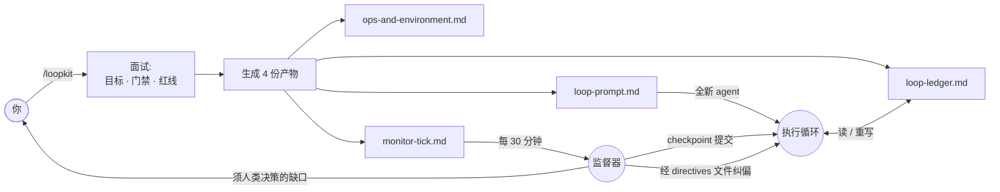

<div align="center">

# 🔁 loopkit

**把长周期编码任务，跑成一个自我监督、不漂移的智能体循环。**

一个 [Claude Code](https://claude.com/claude-code) 技能：把"让这个项目达到生产标准"这类模糊目标，转成一套有唯一记分板、有硬性防膨胀规则、并可选配监督器定时纠偏的多轮循环。

[](LICENSE)
[](CONTRIBUTING.md)


[English](README.md) · 简体中文

</div>

---

## 痛点

给智能体一个又大又模糊的目标——"把这个仓库做到生产质量""把精度提到基线以上""完成迁移"——跑上几十轮它就开始漂移：

- **范围蔓延**：没人要的新抽象、v2 端点、"灵活"配置；
- **假装完成**：写了没有生产调用面的测试、能编译却什么也不做的功能；
- **偷偷降标**：改了冻结契约、让某个指标回退、"顺手优化"了旁边的代码；
- **丢失主线**：没有唯一真相，第 30 轮和第 5 轮自相矛盾。

结果你还是得每一轮盯着它。

## 思路

**loopkit** 只面试你一次，然后生成一个能让智能体连跑多轮、无需盯梢的循环——因为纪律被写进了它无法绕过的规则里：

- 🧾 **唯一记分板。** 单一 `loop-ledger.md` 是唯一真相。代码、文档、台账冲突 → 先修台账。
- 🎯 **一轮只做一项 → 当轮验证 → 更新台账。** 不批处理，不"以后再测"。
- 🧹 **强制收敛。** 每第 5 轮零新功能——只删死代码、收紧接口（净行数 ≤ 0）。单轮净增 >400 行则下一轮强制收敛。
- 📌 **发现即登记。** 任何中途发现的缺口都登记进台账，不静默修、不忽略。
- 🚧 **红线即停。** 未授权不 push、不对他人改动做破坏性 git、密钥绝不入提交、冻结契约保持冻结、指标只升不降。
- 👀 **可选监督器。** 定时巡检，checkpoint 提交干净成果并纠偏——**且绝不编辑执行方正在写的台账**。

## 工作原理



执行方对着台账跑循环。监督器旁观、提交干净的 checkpoint、并经一个 directives 文件注入纠偏——两者永不争抢同一个文件。

## 快速开始

1. **安装技能** —— 一行搞定：

   ```bash
   curl -fsSL https://raw.githubusercontent.com/levi-qiao/loopkit/main/install.sh | sh
   ```

   <sub>想手动？`git clone https://github.com/levi-qiao/loopkit ~/.claude/skills/loopkit`</sub>

2. **在 Claude Code 里调用**：

   ```
   /loopkit
   ```

   回答简短面试（仓库与分支、目标 + 如何验证、里程碑、门禁命令、红线、提交授权、是否要监督器）。

3. **启动执行方。** loopkit 交给你一份 `loop-prompt.md`——粘进一个全新 agent 上下文（或你的循环机制）让它跑。

4. **启动监督器**（可选）。loopkit 按你的间隔调度 `monitor-tick.md`，从此自动巡检。

> 没有 Claude Code？`templates/` 都是纯 Markdown——手动填好，方法论在任何智能体上照样成立。

## 目录

| 路径 | 说明 |
| --- | --- |
| [`SKILL.md`](SKILL.md) | 技能入口——面试 + 生成流程。 |
| [`templates/loop-prompt.md`](templates/loop-prompt.md) | 执行提示词模板。 |
| [`templates/ledger.md`](templates/ledger.md) | 唯一记分板模板。 |
| [`templates/ops-and-environment.md`](templates/ops-and-environment.md) | 环境/构建/数据事实模板。 |
| [`templates/monitor-tick.md`](templates/monitor-tick.md) | 监督器提示词模板。 |
| [`docs/methodology.md`](docs/methodology.md) | 深度解析：每条规则防的是哪种失败。 |
| [`examples/add-tests-to-cli/`](examples/add-tests-to-cli/) | 一个完整的脱敏样例。 |

## 何时用，何时别用

**适用**：任务跨很多轮、成功可验证（测试/门禁/指标）、且确有范围蔓延或降标风险。

**不适用**：一次性小改，或每一步都需要人来判断是否成功——那种情况用普通任务更好。

## 常见问题

**只能配 Claude Code 用吗？** 技能封装与基于 `CronCreate` 的监督器是 Claude Code 特性，但四份产物是纯 Markdown——方法论与具体智能体无关。

**固定第 5 轮收敛会不会太武断？** 那只是默认值；面试里可调间隔与净行数上限。关键是存在*某个*强制收敛机制，而非具体数字。

**循环能自己 commit / push 吗？** 仅当你在面试里授权。安全默认：执行方只实现+验证；提交是单独的授权步骤（常由监督器做），push 永不自动。

## 贡献

欢迎 Issue 与 PR，见 [CONTRIBUTING.md](CONTRIBUTING.md)。如果 loopkit 帮你省下了盯梢智能体的一个周末，点个 ⭐ 能让更多人找到它。

## 许可证

[MIT](LICENSE) © 2026 levi-qiao
