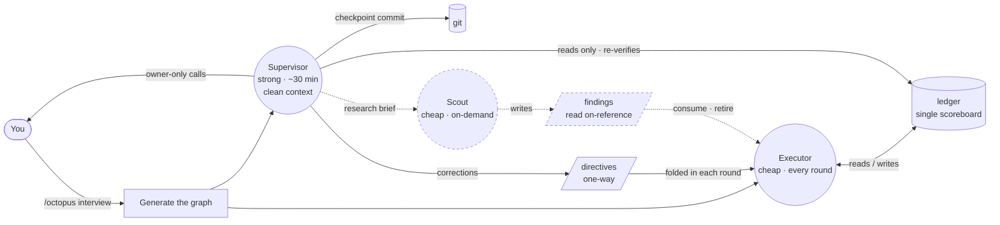

<div align="center">

# loop-graph

**Run a long coding task as a small graph of agent nodes, not one drifting loop.**

A [Claude Code](https://claude.com/claude-code) skill that turns *"make this production-ready"* into an executor node that does the work and a supervisor node that watches from outside the executor's context and corrects drift before it compounds.

graphkit is **graph engineering** made concrete — the shift from tuning a single agent loop to wiring specialized agent roles into a graph. Two roles today; more planned.

[](../../LICENSE)
[](../../CONTRIBUTING.md)


English · [简体中文](README.zh-CN.md)

</div>

---

## The problem

Hand an agent a large, vague goal — *"get this repo to production quality"*, *"push accuracy above baseline"*, *"finish the migration"* — and over dozens of rounds it drifts:

- scope creep: new abstractions, v2 endpoints, config nobody asked for;
- fake "done": tests with no production call site, features that compile but do nothing;
- a quietly lowered bar: a frozen contract changed, a metric regressed;
- a lost thread: no single source of truth, so round 30 contradicts round 5.

The agent cannot catch this in itself: it reasons from the same history that produced the drift, so it will report itself on-spec. You end up reviewing every round by hand.

## From loop engineering to graph engineering

Loop engineering tries to fix this inside the loop — better prompts, more reminders, a bigger context window. It plateaus, because the loop's own history is what corrupts its judgment.

Graph engineering moves the structure outside the model: a small graph of specialized agent roles, each starting from a clean context, connected only by durable, inspectable state. graphkit applies this to one scenario — long-horizon coding — with the smallest useful graph:

- **Executor** — does the work, one item per round, against a single ledger.
- **Supervisor** — starts from a clean context on every tick and audits the run like an outside reviewer at acceptance: it **re-runs the gates itself** and inspects the real diff against the acceptance criteria and the repo's own standards (`AGENTS.md`/`CLAUDE.md`, `ops.md`), so it catches the drift, fake-done, and undisclosed shortcuts the executor cannot see in the context where the corner was cut — then commits what passes, decides pending items, and adjusts the plan through the one-way directives edge.

The graph is designed to grow beyond these two roles — see the [roadmap](#roadmap-more-node-roles).

The nodes communicate only through inspectable state — a ledger, a git tree, a one-way directives file — so the discipline is enforced by the wiring:

- **One scoreboard.** `ledger.md` is the single source of truth. When code, docs and ledger disagree, the ledger is fixed first.
- **One item per round**, verified the same round, then logged. No batching, no deferred testing.
- **Forced convergence, tracked in the ledger.** A convergence round — no new features, net lines ≤ 0 — fires on whichever comes first: every Nth round (default 5) or once accumulated net lines cross the cap (default 400). The trigger is an explicit flag in the scoreboard, not a modulo the stateless loop must recompute, so it can't be silently skipped — and the supervisor audits that it happened.
- **Register-then-defer.** Gaps found mid-round are logged, not silently patched or ignored.
- **Red lines that halt the run.** No unauthorized push, no destructive git on others' work, no secrets in commits, frozen contracts stay frozen, metrics never regress.
- **Independent acceptance audit.** The supervisor re-verifies claimed-done work from its clean context — re-running the gates and checking the real diff against the acceptance bar and the shared standards (`ops.md`, `AGENTS.md`/`CLAUDE.md`) — and corrects drift, fake-done, wasteful method, or a stale plan only through the directives file. It never edits the ledger and never shares the executor's context. It commits what passes and decides by default; only a short owner-only list escalates to you.
- **Pre-adjudicated authority.** Owner-only decisions on the goal's critical path (e.g. dropping dead tables when the goal *is* slimming the schema) are settled up front in the interview into a **standing authorization** — an objective evidence bar the loop acts under autonomously — so the run executes its own work instead of stalling on "proposals awaiting sign-off". Only genuinely case-by-case calls escalate to you.

No LangGraph, no Python runtime, no orchestration server: the nodes and edges are Markdown files any coding agent can follow.

## How it works



Solid edges are the core graph: the executor works against the ledger; the supervisor watches from outside, commits clean checkpoints, and injects corrections through the one-way directives edge. The two never share a context and never write the same file. The dashed **scout** is an optional node — added only when research needs to happen off the critical path — writing to its own findings edge (see the [roadmap](#roadmap-more-node-roles)).

## One strong model, cheap execution

Because the nodes share no context, each can run on a different model. The discipline is what makes a cheap executor safe: its scope is capped at one item per round, the rules live in the ledger and directives rather than in its context, and a stronger model reviews the result.

| Node | Runs | Model | Why |
| --- | --- | --- | --- |
| Authoring (`/octopus` interview) | once | your best model | designing gates, red lines and milestones is the judgment call |
| Executor | every round | a cheap / fast agent — a budget tier, a local model, an OSS coder | it follows an explicit ledger one step at a time |
| Supervisor | every ~30 min | a strong model | judging a run from a cold read is the hardest call, but it fires rarely |

The executor prompt is plain Markdown pointing at plain Markdown — paste it into whichever agent is cheapest. The expensive reasoning is concentrated in authoring and the occasional audit, not spent on every round.

## Hosts and the loop

A *node* is a role — executor, supervisor. A *host* is just a **loop that re-invokes a node and resumes it from the ledger**: Claude Code `/loop`, a Codex task, a Cursor background agent's follow-up cycle, or any agent CLI in a shell `while`. The node keeps no memory between iterations — the ledger is the memory — so a dropped session resumes with nothing lost. Hosts are interchangeable; the graph doesn't change. Two rules keep a host from becoming a second scoreboard:

- **The ledger is a live file, not host text.** Hand the loop a thin pointer at the run files; it re-reads them each round — never fold the ledger into the host's own prompt text, where it goes stale. A host's progress UI *mirrors* the ledger; it never replaces it, and the ledger wins every conflict.
- **The supervisor is its own loop, in a fresh context** — a separate schedule or cron tick, never a subagent inside the executor's loop. That subagent would share the context the whole method keeps clean.

Hosts pace two ways. **Adaptive** hosts (Codex, Claude Code self-paced `/loop`) re-invoke when the last round returns, so a round is never cut off. **Interval** hosts (Grok, Cursor, cron) take a delay you set — `/octopus` sizes it from how long a round takes and prints it in the start command (Cursor is capped at ~20m or the run is killed). The executor and supervisor run on separate, phase-offset schedules and never interrupt each other's in-flight round.

Both loops **stop themselves** when the run is done — the executor when the ledger reaches `exit-ready`/`closed`, the supervisor once there's nothing left to checkpoint — so a finished run never idles overnight burning tokens. A cheap executor loop on one host and a strong supervisor loop on another is a first-class setup, not a special integration.

## Quickstart

1. **Install** the octopus library (this arm ships inside it):

   ```bash
   curl -fsSL https://raw.githubusercontent.com/levi-qiao/octopus-skill/main/install.sh | sh
   ```

   <sub>Installs as a single `/octopus` skill for Claude Code and Codex.</sub>

2. **Run `/octopus` in Claude Code** and answer the interview: repos and branches, the goal and how it is verified, milestones, gate commands, red lines, commit authorization, supervisor interval. The files land in a fresh `.graphkit/<date-slug>/` directory in your repo — one directory per run; a new run never edits an old run's files. ([What each file does →](#files-generated-per-run))

3. **Start the executor loop** with the command `/octopus` prints in the chat — a thin pointer at `executor.md` on your host's loop (Claude Code `/loop`, a Cursor agent, or an agent CLI in a shell). It resumes from the ledger if the session dies, and **ends the loop itself** when the run reaches `exit-ready` — no overnight idling, no nudging each turn.

4. **Start the supervisor loop** (optional, recommended): a second loop that runs `supervisor.md` at your interval in a fresh context — in Claude Code via cron, otherwise a fresh session each interval. It stops itself once the run is done, so it never idles overnight.

Without Claude Code, fill in `templates/` by hand — the method does not depend on the runtime.

## Repository layout

These files are read, not edited:

| Path | What it is |
| --- | --- |
| [`SKILL.md`](SKILL.md) | The skill entry: the interview and generation flow behind `/octopus`. |
| [`templates/`](templates/) | Node and edge templates the skill fills in per run; usable by hand outside Claude Code. |
| [`methodology`](../../lib/methodology.md) | The rationale: each rule and the failure mode it prevents. |
| [`examples/add-tests-to-cli/`](examples/add-tests-to-cli/) | A worked run — executor and ledger three rounds in. Start here. |
| [`examples/migrate-blob-storage/`](examples/migrate-blob-storage/) | A longer worked run — milestones, a pilot-before-cohort backfill, a convergence round, a supervisor directive catching self-reported evidence, and the non-skippable milestone gate in action. |

## Files generated per run

Each run gets a fresh `.graphkit/<date-slug>/` in your repo:

| File | Written by | Role |
| --- | --- | --- |
| `executor.md` | generated once | The executor prompt — the loop's thin pointer target. Encodes the loop's self-stop. |
| `ledger.md` | the executor, every round | Single source of truth: goals, gates, round log, open gaps. Read this to follow the run. |
| `directives.md` | the supervisor, one-way | Corrections, read by the executor each round. You can append your own. |
| `ops.md` | any node, append-only | Durable environment, build and data facts. |
| `supervisor.md` | generated once | The supervisor prompt; scheduled automatically in Claude Code, and stops its own loop when the run ends. |

## When to use it

Use it when the task spans many rounds, success is verifiable (tests, gates, metrics) and drift is a real risk. Skip it for one-shot edits, or for work where every step needs a human to judge success.

## FAQ

**Why a graph and not "a loop with a monitor"?** The load-bearing property is that the supervisor is a separate node with its own clean context, connected to the executor only by inspectable edges. That separation — not the schedule — is what lets it catch drift the executor can't. Multi-agent frameworks model runs as graphs for the same reason; graphkit does it with Markdown instead of a runtime.

**Does it require Claude Code?** The skill packaging and supervisor scheduling are Claude Code features, but the nodes and edges are plain Markdown — the method is agent-agnostic. The intended setup is mixed: author the graph once with a strong model, then run the executor on whatever agent is cheapest.

**Isn't a fixed 5th-round convergence arbitrary?** It's a default, and it isn't purely fixed: convergence fires on whichever comes first — N rounds *or* accumulated net lines over the cap — so a bloat-heavy stretch converges sooner and a quiet one doesn't waste a round. Both bounds are tuned to the plan at generation. It's also tracked as an explicit flag in the ledger (not a modulo the loop recomputes), so it actually triggers. What matters is that a forcing function exists and reliably fires, not the exact number.

**Can a node commit or push on its own?** Only if you authorize it in the interview. The safe default: the executor implements and verifies, commits are a separate authorized step (often the supervisor's), and push is never automatic.

## Roadmap: more node roles

Executor plus supervisor is the smallest useful graph, not the whole idea. A role is one Markdown node plus an inspectable edge — no framework, no runtime — so the graph grows one file at a time. Planned roles: a red-team reviewer that probes "done" claims, a scout that researches options off the critical path and reports into the ledger, and a test oracle that owns the gates so the executor cannot grade its own work. These make good first contributions.

## Contributing

Issues and PRs welcome — see [CONTRIBUTING.md](../../CONTRIBUTING.md).

## License

[MIT](../../LICENSE) © 2026 levi-qiao
